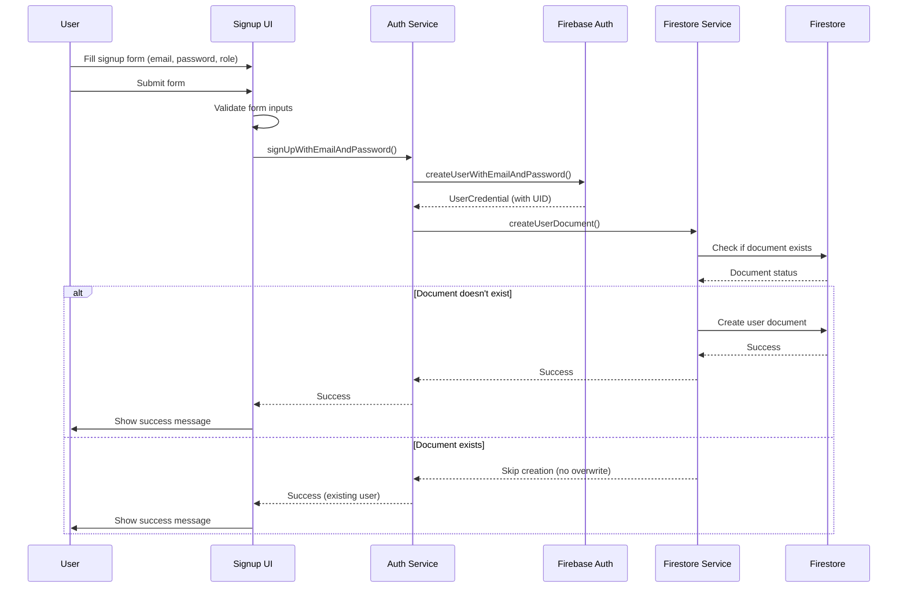

# Design Document

## Overview

This design implements a comprehensive Firebase Authentication signup system with automatic Firestore user document creation. The solution integrates Firebase Auth for user authentication and Cloud Firestore for user profile storage, ensuring data consistency and providing robust error handling throughout the signup process.

The design leverages the existing Firebase infrastructure already configured in the application and extends the current Firestore service to support the new signup workflow. The implementation will replace the current simple test interface with a proper authentication signup form.

## Architecture

### High-Level Flow


### Component Architecture
- **SignupScreen**: New UI component for user registration
- **AuthService**: Service layer for Firebase Authentication operations
- **FirestoreService**: Extended to handle user document creation with existence checks
- **UserModel**: Existing model updated to support the new role enum values

## Components and Interfaces

### 1. SignupScreen Widget
**Purpose**: Provides the user interface for account registration

**Key Features**:
- Email and password input fields with validation
- Role selection via radio buttons (patient/doctor)
- Form validation and error display
- Loading states and success/error messaging
- Integration with AuthService for signup operations

**State Management**:
- Form controllers for email and password
- Selected role state
- Loading state for async operations
- Error/success message state

### 2. AuthService
**Purpose**: Handles Firebase Authentication operations and coordinates with Firestore

**Methods**:
```dart
class AuthService {
  // Main signup method that handles both auth and Firestore creation
  Future<AuthResult> signUpWithEmailAndPassword({
    required String email,
    required String password,
    required UserRole role,
  });
  
  // Helper method for Firebase Auth signup
  Future<UserCredential> _createFirebaseUser(String email, String password);
  
  // Error handling and message formatting
  String _formatAuthError(FirebaseAuthException e);
}
```

**Return Type**:
```dart
class AuthResult {
  final bool success;
  final String? errorMessage;
  final User? user;
  
  AuthResult({required this.success, this.errorMessage, this.user});
}
```

### 3. Enhanced FirestoreService
**Purpose**: Extended to support user document creation with existence checks

**New Methods**:
```dart
// Check if user document exists
Future<bool> userDocumentExists(String uid);

// Create user document only if it doesn't exist
Future<void> createUserDocumentIfNotExists({
  required String uid,
  required String email,
  required UserRole role,
});
```

**Updated addUser Method**:
- Remove the `name` parameter requirement
- Use UID as document ID instead of auto-generated ID
- Add existence check to prevent overwrites

### 4. Updated UserModel
**Purpose**: Support the new role values and remove name requirement

**Changes**:
- Update UserRole enum to include 'patient' and 'doctor' values
- Make name field optional in constructor
- Update factory methods to handle missing name field

## Data Models

### User Document Structure (Firestore)
```json
{
  "email": "user@example.com",
  "role": "patient", // or "doctor"
  "createdAt": "2024-01-15T10:30:00Z", // Server timestamp
  "uid": "firebase_auth_uid" // Optional, for reference
}
```

### UserRole Enum Update
```dart
enum UserRole { 
  patient, // Updated from 'user'
  doctor   // Existing value
}
```

### Form Validation Rules
- **Email**: Must be valid email format, required
- **Password**: Minimum 6 characters (Firebase default), required
- **Role**: Must select either patient or doctor, required

## Error Handling

### Firebase Auth Errors
- `weak-password`: "Password should be at least 6 characters"
- `email-already-in-use`: "An account already exists with this email"
- `invalid-email`: "Please enter a valid email address"
- `network-request-failed`: "Network error. Please check your connection"
- Default: "Signup failed. Please try again"

### Firestore Errors
- Permission denied: "Unable to create user profile. Please try again"
- Network errors: "Connection error. Please check your internet"
- Unknown errors: "Profile creation failed. Please contact support"

### Error Display Strategy
- Show errors in a styled container below the form
- Use red color for error messages
- Use green color for success messages
- Clear previous messages when new operations start
- Maintain form data when errors occur (don't clear inputs)

## Testing Strategy

### Unit Tests
1. **AuthService Tests**:
   - Test successful signup flow
   - Test Firebase Auth error handling
   - Test Firestore integration
   - Test existing user document handling

2. **FirestoreService Tests**:
   - Test user document creation
   - Test existence check functionality
   - Test error handling for Firestore operations

3. **Form Validation Tests**:
   - Test email validation
   - Test password validation
   - Test role selection validation

### Integration Tests
1. **End-to-End Signup Flow**:
   - Complete signup with valid data
   - Verify Firebase Auth account creation
   - Verify Firestore document creation
   - Test duplicate signup prevention

2. **Error Scenarios**:
   - Network connectivity issues
   - Invalid credentials
   - Firestore permission errors

### Widget Tests
1. **SignupScreen Tests**:
   - Test form rendering
   - Test input validation
   - Test role selection
   - Test loading states
   - Test error message display

## Implementation Notes

### Code Organization
- Create new `lib/screens/auth/signup_screen.dart`
- Create new `lib/services/auth_service.dart`
- Update existing `lib/services/firestore_service.dart`
- Update existing `lib/models/user_model.dart`
- Remove test functionality from `lib/simple_main.dart`

### Dependencies
All required dependencies are already present in pubspec.yaml:
- `firebase_auth: ^5.3.1`
- `cloud_firestore: ^5.6.12`
- `firebase_core: ^3.15.2`

### Security Considerations
- Use Firebase Auth security rules
- Implement proper Firestore security rules
- Validate all inputs on both client and server side
- Use server timestamps for createdAt field
- Store minimal user data in Firestore documents

### Performance Considerations
- Use existence check before document creation to avoid unnecessary writes
- Implement proper loading states to improve user experience
- Use appropriate error handling to prevent app crashes
- Consider offline capabilities for better user experience